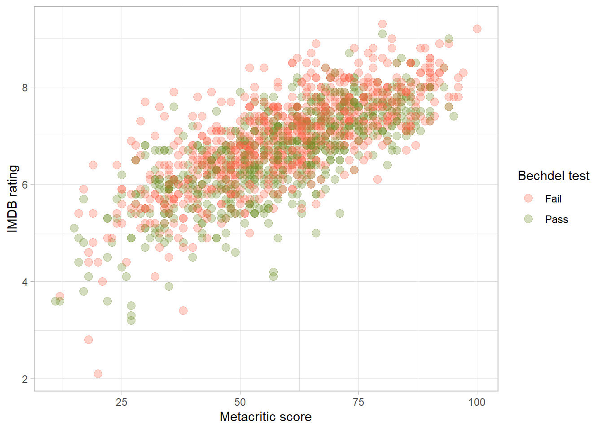
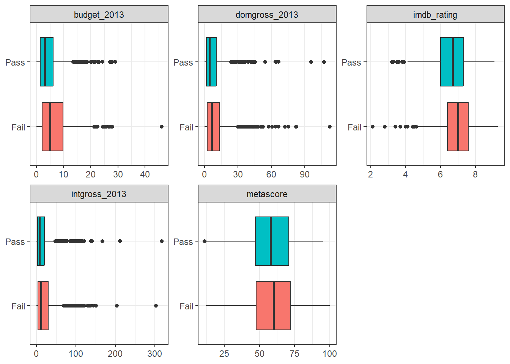
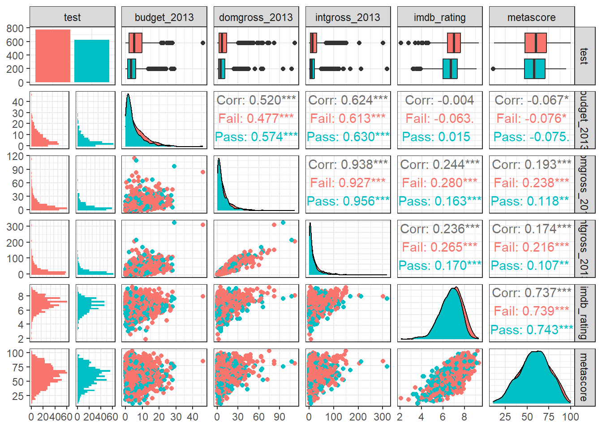
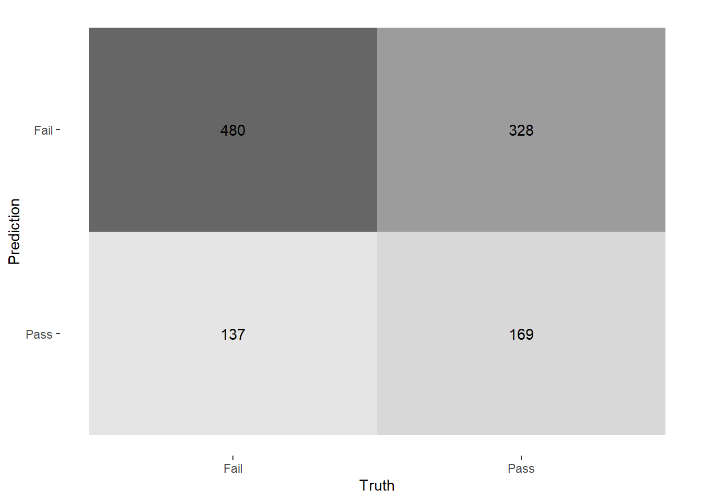
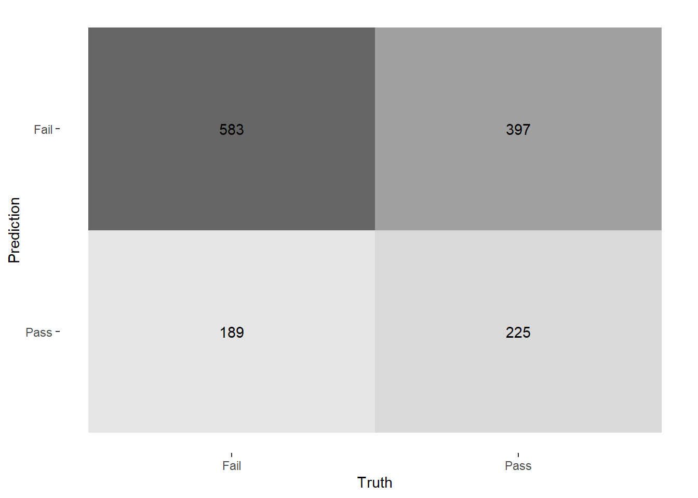
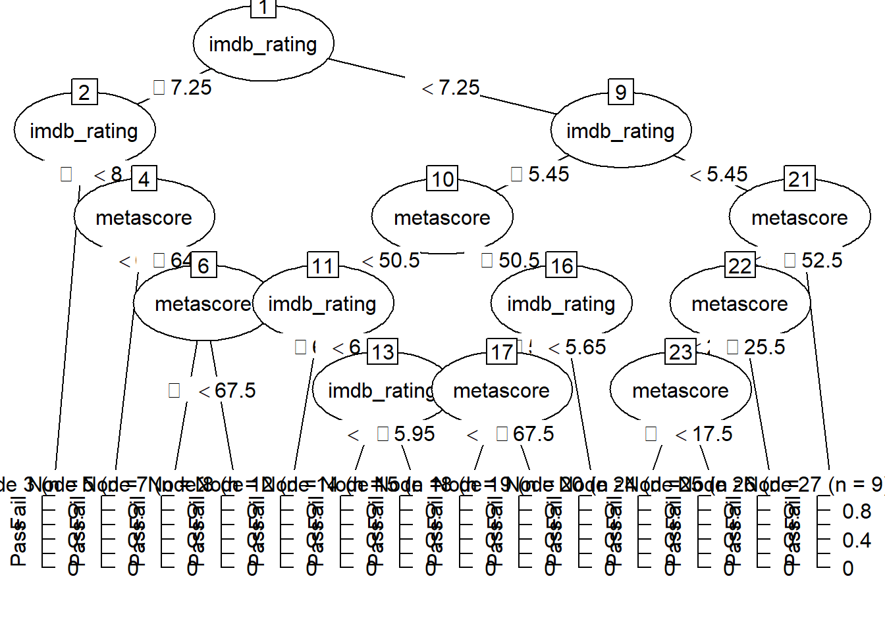
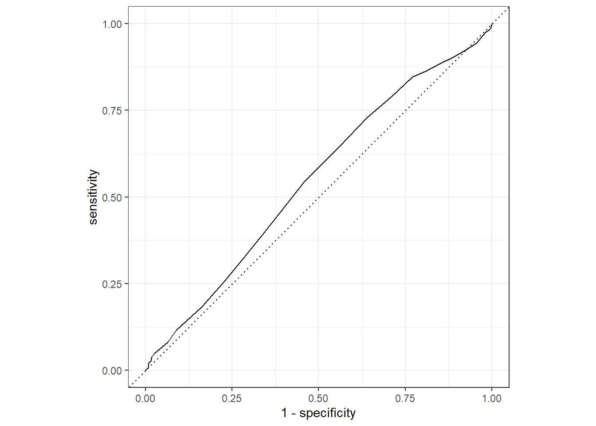
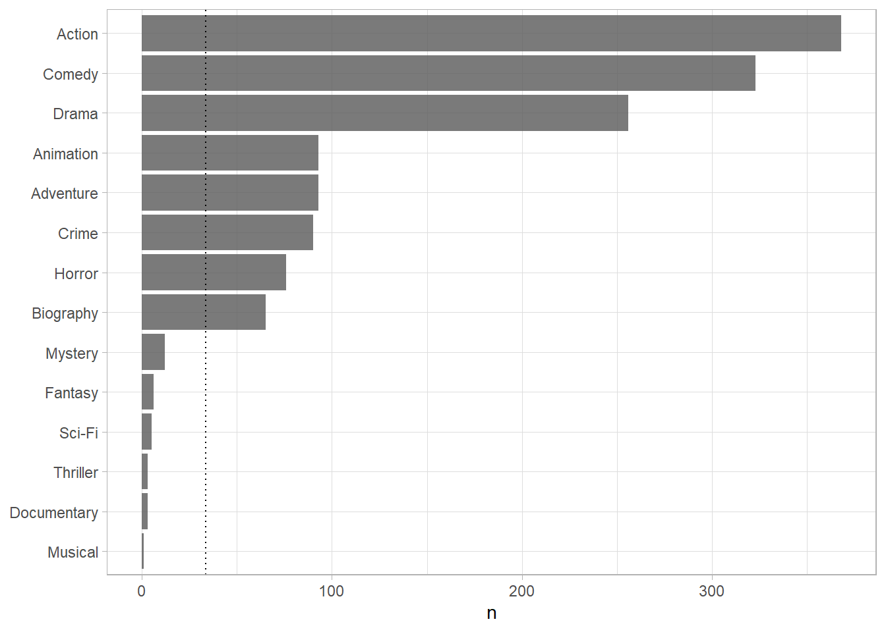
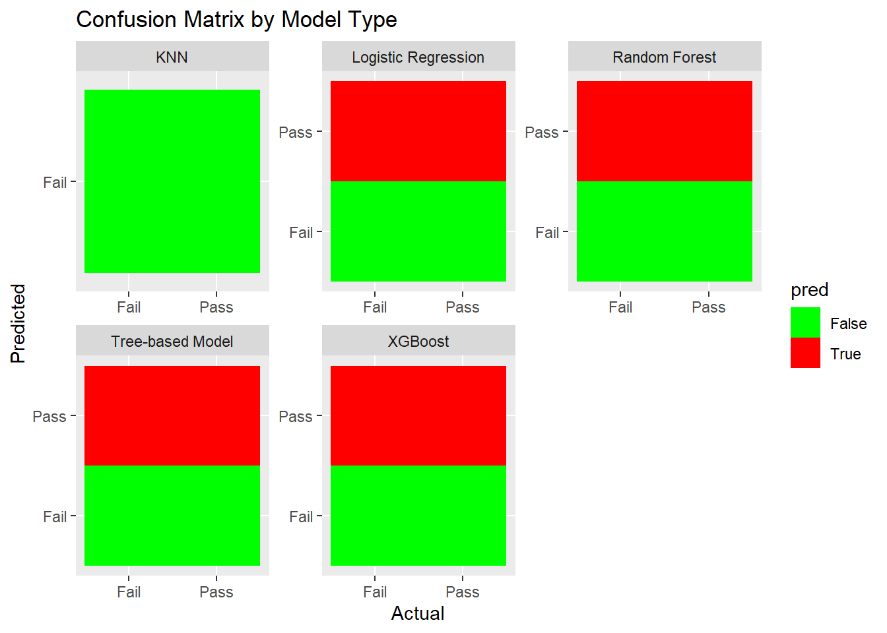

# The Bechdel Test

<https://fivethirtyeight.com/features/the-dollar-and-cents-case-against-hollywoods-exclusion-of-women/>

The [Bechdel test](https://bechdeltest.com) is a way to assess how women are depicted in Hollywood movies. In order for a movie to pass the test:

1.  It has to have at least two [named] women in it
2.  Who talk to each other
3.  About something besides a man

There is a nice article and analysis you can find here <https://fivethirtyeight.com/features/the-dollar-and-cents-case-against-hollywoods-exclusion-of-women/> We have a sample of 1394 movies and we want to fit a model to predict whether a film passes the test or not.


```r
bechdel <- read_csv(here::here("data", "bechdel.csv")) %>% 
  mutate(test = factor(test)) 
```

```
## Rows: 1394 Columns: 10
## ── Column specification ────────────────────────────────────────────────────────
## Delimiter: ","
## chr (4): title, test, rated, genre
## dbl (6): year, budget_2013, domgross_2013, intgross_2013, metascore, imdb_ra...
## 
## ℹ Use `spec()` to retrieve the full column specification for this data.
## ℹ Specify the column types or set `show_col_types = FALSE` to quiet this message.
```

```r
glimpse(bechdel)
```

```
## Rows: 1,394
## Columns: 10
## $ year          <dbl> 2013, 2013, 2013, 2013, 2013, 2013, 2013, 2013, 2013, 20…
## $ title         <chr> "12 Years a Slave", "2 Guns", "42", "47 Ronin", "A Good …
## $ test          <fct> Fail, Fail, Fail, Fail, Fail, Pass, Pass, Fail, Pass, Pa…
## $ budget_2013   <dbl> 2.00, 6.10, 4.00, 22.50, 9.20, 1.20, 1.30, 13.00, 4.00, …
## $ domgross_2013 <dbl> 5.3107035, 7.5612460, 9.5020213, 3.8362475, 6.7349198, 1…
## $ intgross_2013 <dbl> 15.8607035, 13.2493015, 9.5020213, 14.5803842, 30.424919…
## $ rated         <chr> "R", "R", "PG-13", "PG-13", "R", "R", "PG-13", "PG-13", …
## $ metascore     <dbl> 97, 55, 62, 29, 28, 55, 48, 33, 90, 58, 52, 78, 83, 53, …
## $ imdb_rating   <dbl> 8.3, 6.8, 7.6, 6.6, 5.4, 7.8, 5.7, 5.0, 7.5, 7.4, 6.2, 7…
## $ genre         <chr> "Biography", "Action", "Biography", "Action", "Action", …
```

How many films fail/pass the test, both as a number and as a %?


```r
pass_fail <- bechdel %>% 
  
  # Grouping by test result and counting
  group_by(test) %>% 
  summarise(count = n()) %>% 
  
  # Now summing the count to use as denomitor, to find percentage
  mutate(pct = round(count/sum(count)*100,2))

# Showing result
pass_fail
```

```
## # A tibble: 2 × 3
##   test  count   pct
##   <fct> <int> <dbl>
## 1 Fail    772  55.4
## 2 Pass    622  44.6
```

## Movie scores


```r
ggplot(data = bechdel, aes(
  x = metascore,
  y = imdb_rating,
  colour = test
)) +
  geom_point(alpha = .3, size = 3) +
  scale_colour_manual(values = c("tomato", "olivedrab")) +
  labs(
    x = "Metacritic score",
    y = "IMDB rating",
    colour = "Bechdel test"
  ) +
 theme_light()
```



# Split the data


```r
# **Split the data**

set.seed(123)

data_split <- initial_split(bechdel, # updated data
                           prop = 0.8, 
                           strata = test)

bechdel_train <- training(data_split) 
bechdel_test <- testing(data_split)
```

Check the counts and % (proportions) of the `test` variable in each set.


```r
# First for the training set

pass_fail_train <- bechdel_train %>% 
  
  # Grouping by test result and counting
  group_by(test) %>% 
  summarise(count = n()) %>% 
  
  # Now summing the count to use as denomitor, to find percentage
  mutate(pct = round(count/sum(count)*100,2))

# Showing result
pass_fail_train
```

```
## # A tibble: 2 × 3
##   test  count   pct
##   <fct> <int> <dbl>
## 1 Fail    617  55.4
## 2 Pass    497  44.6
```

```r
# Now for the test set

# Grouping by test result and counting
pass_fail_test <- bechdel_test %>% 

  # Grouping by test result and counting
  group_by(test) %>% 
  summarise(count = n()) %>% 
  
  # Now summing the count to use as denomitor, to find percentage
  mutate(pct = round(count/sum(count)*100,2))

# Showing result
pass_fail_test
```

```
## # A tibble: 2 × 3
##   test  count   pct
##   <fct> <int> <dbl>
## 1 Fail    155  55.4
## 2 Pass    125  44.6
```

## Feature exploration

## Any outliers?


```r
bechdel %>% 
  select(test, budget_2013, domgross_2013, intgross_2013, imdb_rating, metascore) %>% 

    pivot_longer(cols = 2:6,
               names_to = "feature",
               values_to = "value") %>% 
  ggplot()+
  aes(x=test, y = value, fill = test)+
  coord_flip()+
  geom_boxplot()+
  facet_wrap(~feature, scales = "free")+
  theme_bw()+
  theme(legend.position = "none")+
  labs(x=NULL,y = NULL)
```



## Scatterplot - Correlation Matrix

Write a paragraph discussing the output of the following


```r
bechdel %>% 
  select(test, budget_2013, domgross_2013, intgross_2013, imdb_rating, metascore)%>% 
  ggpairs(aes(colour=test), alpha=0.2)+
  theme_bw()
```



The above plot tells us the distribution and correlation of the following variables for movies that failed and passed the test:

-   budget_2013

    -   The distribution is highly positively skewed, meaning it has a low peak relative to its long right tail, with a very marginal difference for pass/fail movies

    -   It is positively correlated to domgross_2013 and intgross_2013, both of which are stronger for the 'pass' category

    -   There is no/very weak correlation with imdb_rating and metascore

-   domgross_2013

    -   The distribution is identical for pass/fail movies, with a highly positive skew

    -   Has a near perfect positive correlation with intgross_2013, though slightly higher for movies that passed

    -   Both pass and fail have slightly positive correlation with imdb_rating and metascore, though movies in the fail category are slightly stronger for both

-   intgross_2013

    -   The distribution is identical for pass/fail movies, with a highly positive skew

    -   Both pass and fail have slightly positive correlation with imdb_rating and metascore, though movies in the fail category are slightly stronger for both

-   imdb_rating

    -   Has a relatively normal distribution, weighted towards a negative skew

    -   Has strong positive correlation with metascore, with no clear difference between pass/fail movies

-   metascore

    -   Has a relatively normal distribution, with no clear skew

## Categorical variables

Write a paragraph discussing the output of the following


```r
bechdel %>% 
  group_by(genre, test) %>%
  summarise(n = n()) %>% 
  mutate(prop = n/sum(n)) %>% 
  
  # Arranging the data for easier analysis
  arrange(test, -prop)
```

```
## `summarise()` has grouped output by 'genre'. You can override using the
## `.groups` argument.
```

```
## # A tibble: 24 × 4
## # Groups:   genre [14]
##    genre       test      n  prop
##    <chr>       <fct> <int> <dbl>
##  1 Documentary Fail      3 1    
##  2 Sci-Fi      Fail      5 1    
##  3 Mystery     Fail      9 0.75 
##  4 Action      Fail    260 0.707
##  5 Animation   Fail     63 0.677
##  6 Fantasy     Fail      4 0.667
##  7 Crime       Fail     56 0.622
##  8 Adventure   Fail     52 0.559
##  9 Biography   Fail     36 0.554
## 10 Drama       Fail    121 0.473
## # ℹ 14 more rows
```

```r
bechdel %>% 
  group_by(rated, test) %>%
  summarise(n = n()) %>% 
  mutate(prop = n/sum(n)) %>% 
  
  # Arranging the data for easier analysis
  arrange(test, -prop)
```

```
## `summarise()` has grouped output by 'rated'. You can override using the
## `.groups` argument.
```

```
## # A tibble: 10 × 4
## # Groups:   rated [5]
##    rated test      n  prop
##    <chr> <fct> <int> <dbl>
##  1 NC-17 Fail      5 0.833
##  2 G     Fail     16 0.615
##  3 R     Fail    353 0.568
##  4 PG    Fail    115 0.561
##  5 PG-13 Fail    283 0.529
##  6 PG-13 Pass    252 0.471
##  7 PG    Pass     90 0.439
##  8 R     Pass    269 0.432
##  9 G     Pass     10 0.385
## 10 NC-17 Pass      1 0.167
```

The above dataframes show us the pass and fail rate, for movies based on their i) genre, and ii) rating.

#### Genre

Focusing on the genres with sufficiently large sample sizes (above 20), action has the highest failure rate, at 70%. Animation is close behind, at 67%, and crime fails 62% of the time. Adventure, biography, and drama movies, fail at 55%, 55%, and 47% respectively. Comedy and horror films have the lowest failure rates at 42% and 33% respectively.

#### Rating

Failure rates across genres vary between 83% and 52%. NC-17 films fail at 83%, but the sample size is small with only 6 total movies with that rating. G rates films fail at a 62% rate, and R and PG rates films fail at a 56% rate. PG-13 films fail at the lowest rate, of 52%.

# Train first models. `test ~ metascore + imdb_rating`


```r
lr_mod <- logistic_reg() %>% 
  set_engine(engine = "glm") %>% 
  set_mode("classification")

lr_mod
```

```
## Logistic Regression Model Specification (classification)
## 
## Computational engine: glm
```

```r
tree_mod <- decision_tree() %>% 
  set_engine(engine = "C5.0") %>% 
  set_mode("classification")

tree_mod 
```

```
## Decision Tree Model Specification (classification)
## 
## Computational engine: C5.0
```


```r
lr_fit <- lr_mod %>% # parsnip model
  fit(test ~ metascore + imdb_rating, # a formula
    data = bechdel_train # dataframe
  )

tree_fit <- tree_mod %>% # parsnip model
  fit(test ~ metascore + imdb_rating, # a formula
    data = bechdel_train # dataframe
  )
```

## Logistic regression


```r
lr_fit %>%
  broom::tidy()
```

```
## # A tibble: 3 × 5
##   term        estimate std.error statistic  p.value
##   <chr>          <dbl>     <dbl>     <dbl>    <dbl>
## 1 (Intercept)   2.80     0.494        5.68 1.35e- 8
## 2 metascore     0.0207   0.00536      3.86 1.13e- 4
## 3 imdb_rating  -0.625    0.100       -6.24 4.36e-10
```

```r
lr_preds <- lr_fit %>%
  augment(new_data = bechdel_train) %>%
  mutate(.pred_match = if_else(test == .pred_class, 1, 0))
```

### Confusion matrix


```r
lr_preds %>% 
  conf_mat(truth = test, estimate = .pred_class) %>% 
  autoplot(type = "heatmap")
```



Plotting the confusion matrix shows that this model is only 58% accurate (prediction = true), and therefore is not reliable.

## Decision Tree


```r
tree_preds <- tree_fit %>%
  augment(new_data = bechdel) %>%
  mutate(.pred_match = if_else(test == .pred_class, 1, 0)) 
```


```r
tree_preds %>% 
  conf_mat(truth = test, estimate = .pred_class) %>% 
  autoplot(type = "heatmap")
```



Plotting the confusion matrix shows that this model is also only 58% accurate (prediction = true), and therefore is not reliable.

## Draw the decision tree


```r
draw_tree <- 
    rpart::rpart(
        test ~ metascore + imdb_rating,
        data = bechdel_train, # uses data that contains both birth weight and `low`
        control = rpart::rpart.control(maxdepth = 5, cp = 0, minsplit = 10)
    ) %>% 
    partykit::as.party()
plot(draw_tree)
```



# Cross Validation

Run the code below. What does it return?


```r
set.seed(123)
bechdel_folds <- vfold_cv(data = bechdel_train, 
                          v = 10, 
                          strata = test)
bechdel_folds
```

```
## #  10-fold cross-validation using stratification 
## # A tibble: 10 × 2
##    splits             id    
##    <list>             <chr> 
##  1 <split [1002/112]> Fold01
##  2 <split [1002/112]> Fold02
##  3 <split [1002/112]> Fold03
##  4 <split [1002/112]> Fold04
##  5 <split [1002/112]> Fold05
##  6 <split [1002/112]> Fold06
##  7 <split [1002/112]> Fold07
##  8 <split [1004/110]> Fold08
##  9 <split [1004/110]> Fold09
## 10 <split [1004/110]> Fold10
```

This code is used to split the bechdel_train dataset into 10 separate folds for cross-validation. That is used to assess how well a model performs on test (not used for model training) data. In this case, the code performs a stratified cross-validation, which means that each fold has similar distributions of the test results.

## `fit_resamples()`

Trains and tests a resampled model.


```r
lr_fit <- lr_mod %>%
  fit_resamples(
    test ~ metascore + imdb_rating,
    resamples = bechdel_folds
  )


tree_fit <- tree_mod %>%
  fit_resamples(
    test ~ metascore + imdb_rating,
    resamples = bechdel_folds
  )
```

## `collect_metrics()`

Unnest the metrics column from a tidymodels `fit_resamples()`


```r
collect_metrics(lr_fit)
```

```
## # A tibble: 2 × 6
##   .metric  .estimator  mean     n std_err .config             
##   <chr>    <chr>      <dbl> <int>   <dbl> <chr>               
## 1 accuracy binary     0.575    10  0.0149 Preprocessor1_Model1
## 2 roc_auc  binary     0.606    10  0.0189 Preprocessor1_Model1
```

```r
collect_metrics(tree_fit)
```

```
## # A tibble: 2 × 6
##   .metric  .estimator  mean     n std_err .config             
##   <chr>    <chr>      <dbl> <int>   <dbl> <chr>               
## 1 accuracy binary     0.571    10  0.0156 Preprocessor1_Model1
## 2 roc_auc  binary     0.547    10  0.0201 Preprocessor1_Model1
```


```r
tree_preds <- tree_mod %>% 
  fit_resamples(
    test ~ metascore + imdb_rating, 
    resamples = bechdel_folds,
    control = control_resamples(save_pred = TRUE) #<<
  )

# What does the data for ROC look like?
tree_preds %>% 
  collect_predictions() %>% 
  roc_curve(truth = test, .pred_Fail)  
```

```
## # A tibble: 29 × 3
##    .threshold specificity sensitivity
##         <dbl>       <dbl>       <dbl>
##  1   -Inf         0             1    
##  2      0.262     0             1    
##  3      0.317     0.00201       0.989
##  4      0.373     0.00805       0.982
##  5      0.440     0.0181        0.976
##  6      0.459     0.0443        0.943
##  7      0.460     0.0765        0.924
##  8      0.464     0.115         0.901
##  9      0.465     0.147         0.887
## 10      0.465     0.191         0.864
## # ℹ 19 more rows
```

```r
# Draw the ROC
tree_preds %>% 
  collect_predictions() %>% 
  roc_curve(truth = test, .pred_Fail) %>% 
  autoplot()
```



# Build a better training set with `recipes`

## Preprocessing options

-   Encode categorical predictors
-   Center and scale variables
-   Handle class imbalance
-   Impute missing data
-   Perform dimensionality reduction
-   ... ...

## To build a recipe

1.  Start the `recipe()`
2.  Define the variables involved
3.  Describe **prep**rocessing [step-by-step]

## Collapse Some Categorical Levels

Do we have any `genre` with few observations? Assign genres that have less than 3% to a new category 'Other'




```r
movie_rec <-
  recipe(test ~ .,
         data = bechdel_train) %>%
  
  # Genres with less than 5% will be in a catewgory 'Other'
    step_other(genre, threshold = .03) 
```

## Before recipe


```
## # A tibble: 14 × 2
##    genre           n
##    <chr>       <int>
##  1 Action        293
##  2 Comedy        254
##  3 Drama         213
##  4 Adventure      75
##  5 Animation      72
##  6 Crime          68
##  7 Horror         68
##  8 Biography      50
##  9 Mystery         7
## 10 Fantasy         5
## 11 Sci-Fi          3
## 12 Thriller        3
## 13 Documentary     2
## 14 Musical         1
```

## After recipe


```r
movie_rec %>% 
  prep() %>% 
  bake(new_data = bechdel_train) %>% 
  count(genre, sort = TRUE)
```

```
## # A tibble: 9 × 2
##   genre         n
##   <fct>     <int>
## 1 Action      293
## 2 Comedy      254
## 3 Drama       213
## 4 Adventure    75
## 5 Animation    72
## 6 Crime        68
## 7 Horror       68
## 8 Biography    50
## 9 other        21
```

## `step_dummy()`

Converts nominal data into numeric dummy variables


```r
movie_rec <- recipe(test ~ ., data = bechdel) %>%
  step_other(genre, threshold = .03) %>% 
  step_dummy(all_nominal_predictors()) 

movie_rec 
```

```
## 
```

```
## ── Recipe ──────────────────────────────────────────────────────────────────────
```

```
## 
```

```
## ── Inputs
```

```
## Number of variables by role
```

```
## outcome:   1
## predictor: 9
```

```
## 
```

```
## ── Operations
```

```
## • Collapsing factor levels for: genre
```

```
## • Dummy variables from: all_nominal_predictors()
```

## Let's think about the modelling

What if there were no films with `rated` NC-17 in the training data?

-   Will the model have a coefficient for `rated` NC-17?
    -   No, if there are no NC-17 rated movies in the training data, then the model will have a coefficient for any films in this rating.
-   What will happen if the test data includes a film with `rated` NC-17?
    -   If there are NC-17 rated films in the test data, the model will not be able to make a prediction for theses films. The model has no information on the relationship between NC-17 rated films and the test variable, and therefore is not capable of creating an accurate prediction.

## `step_novel()`

Adds a catch-all level to a factor for any new values not encountered in model training, which lets R intelligently predict new levels in the test set.


```r
movie_rec <- recipe(test ~ ., data = bechdel) %>%
  step_other(genre, threshold = .03) %>% 
  step_novel(all_nominal_predictors) %>% # Use *before* `step_dummy()` so new level is dummified
  step_dummy(all_nominal_predictors()) 
```

## `step_zv()`

Intelligently handles zero variance variables (variables that contain only a single value)


```r
movie_rec <- recipe(test ~ ., data = bechdel) %>%
  step_other(genre, threshold = .03) %>% 
  step_novel(all_nominal(), -all_outcomes()) %>% # Use *before* `step_dummy()` so new level is dummified
  step_dummy(all_nominal(), -all_outcomes()) %>% 
  step_zv(all_numeric(), -all_outcomes()) 
```

## `step_normalize()`

Centers then scales numeric variable (mean = 0, sd = 1)


```r
movie_rec <- recipe(test ~ ., data = bechdel) %>%
  step_other(genre, threshold = .03) %>% 
  step_novel(all_nominal(), -all_outcomes()) %>% # Use *before* `step_dummy()` so new level is dummified
  step_dummy(all_nominal(), -all_outcomes()) %>% 
  step_zv(all_numeric(), -all_outcomes())  %>% 
  step_normalize(all_numeric()) 
```

## `step_corr()`

Removes highly correlated variables


```r
movie_rec <- recipe(test ~ ., data = bechdel) %>%
  step_other(genre, threshold = .03) %>% 
  step_novel(all_nominal(), -all_outcomes()) %>% # Use *before* `step_dummy()` so new level is dummified
  step_dummy(all_nominal(), -all_outcomes()) %>% 
  step_zv(all_numeric(), -all_outcomes())  %>% 
  step_normalize(all_numeric()) %>% 
  step_corr(all_predictors(), threshold = 0.75, method = "spearman") 


movie_rec
```

```
## 
```

```
## ── Recipe ──────────────────────────────────────────────────────────────────────
```

```
## 
```

```
## ── Inputs
```

```
## Number of variables by role
```

```
## outcome:   1
## predictor: 9
```

```
## 
```

```
## ── Operations
```

```
## • Collapsing factor levels for: genre
```

```
## • Novel factor level assignment for: all_nominal(), -all_outcomes()
```

```
## • Dummy variables from: all_nominal(), -all_outcomes()
```

```
## • Zero variance filter on: all_numeric(), -all_outcomes()
```

```
## • Centering and scaling for: all_numeric()
```

```
## • Correlation filter on: all_predictors()
```

# Define different models to fit


```r
## Model Building

# 1. Pick a `model type`
# 2. set the `engine`
# 3. Set the `mode`: regression or classification

# Logistic regression
log_spec <-  logistic_reg() %>%  # model type
  set_engine(engine = "glm") %>%  # model engine
  set_mode("classification") # model mode

# Show your model specification
log_spec
```

```
## Logistic Regression Model Specification (classification)
## 
## Computational engine: glm
```

```r
# Decision Tree
tree_spec <- decision_tree() %>%
  set_engine(engine = "C5.0") %>%
  set_mode("classification")

tree_spec
```

```
## Decision Tree Model Specification (classification)
## 
## Computational engine: C5.0
```

```r
# Random Forest
library(ranger)
```

```
## Warning: package 'ranger' was built under R version 4.2.3
```

```r
rf_spec <- 
  rand_forest() %>% 
  set_engine("ranger", importance = "impurity") %>% 
  set_mode("classification")


# Boosted tree (XGBoost)
library(xgboost)
```

```
## Warning: package 'xgboost' was built under R version 4.2.3
```

```
## 
## Attaching package: 'xgboost'
```

```
## The following object is masked from 'package:dplyr':
## 
##     slice
```

```r
xgb_spec <- 
  boost_tree() %>% 
  set_engine("xgboost") %>% 
  set_mode("classification") 

# K-nearest neighbour (k-NN)
knn_spec <- 
  nearest_neighbor(neighbors = 4) %>% # we can adjust the number of neighbors 
  set_engine("kknn") %>% 
  set_mode("classification") 
```

# Bundle recipe and model with `workflows`


```r
log_wflow <- # new workflow object
 workflow() %>% # use workflow function
 add_recipe(movie_rec) %>%   # use the new recipe
 add_model(log_spec)   # add your model spec

# show object
log_wflow
```

```
## ══ Workflow ════════════════════════════════════════════════════════════════════
## Preprocessor: Recipe
## Model: logistic_reg()
## 
## ── Preprocessor ────────────────────────────────────────────────────────────────
## 6 Recipe Steps
## 
## • step_other()
## • step_novel()
## • step_dummy()
## • step_zv()
## • step_normalize()
## • step_corr()
## 
## ── Model ───────────────────────────────────────────────────────────────────────
## Logistic Regression Model Specification (classification)
## 
## Computational engine: glm
```

```r
## A few more workflows

tree_wflow <-
 workflow() %>%
 add_recipe(movie_rec) %>% 
 add_model(tree_spec) 

rf_wflow <-
 workflow() %>%
 add_recipe(movie_rec) %>% 
 add_model(rf_spec) 

xgb_wflow <-
 workflow() %>%
 add_recipe(movie_rec) %>% 
 add_model(xgb_spec)

knn_wflow <-
 workflow() %>%
 add_recipe(movie_rec) %>% 
 add_model(knn_spec)
```

HEADS UP

1.  How many models have you specified?

5

2.  What's the difference between a model specification and a workflow?

A model specification defines the model structure and properties. This means that is specifies the type of model (e.g. linear regression, decision tree, etc.) and the respective parameters.

A model workflow defines the end-to-end process of the model. That is, the data manipulation, training, and predictions.

3.  Do you need to add a formula (e.g., `test ~ .`) if you have a recipe?

No

# Model Comparison

You now have all your models. Adapt the code from slides `code-from-slides-CA-housing.R`, line 400 onwards to assess which model gives you the best classification.


```r
# Fitting the logistic regression model using the training data
log_res <- log_wflow %>%
  fit(data = bechdel_train)
```

```
## Warning: glm.fit: algorithm did not converge
```

```r
# Making the predictions on the test data
log_pred <- log_res %>%
  predict(new_data = bechdel_test) %>%
  bind_cols(bechdel_test$test) %>%
  
  # Tidying column names for clarity
  clean_names() %>%
  rename(pred = pred_class, actual = x2)
```

```
## Warning in predict.lm(object, newdata, se.fit, scale = 1, type = if (type == :
## prediction from a rank-deficient fit may be misleading
```

```
## New names:
## • `` -> `...2`
```

```r
## View the predictions
glimpse(log_pred)
```

```
## Rows: 280
## Columns: 2
## $ pred   <fct> Pass, Pass, Fail, Pass, Pass, Pass, Pass, Pass, Pass, Fail, Pas…
## $ actual <fct> Fail, Fail, Fail, Pass, Fail, Fail, Pass, Fail, Fail, Pass, Fai…
```

```r
# Now repeating for the tree-based model

tree_res <- tree_wflow %>%
  fit(data = bechdel_train)

tree_pred <- tree_res %>%
  predict(new_data = bechdel_test) %>%
  bind_cols(bechdel_test$test) %>%
  clean_names() %>%
  rename(pred = pred_class, actual = x2)
```

```
## New names:
## • `` -> `...2`
```

```r
# Now repeating for the random forest model
rf_res <- rf_wflow %>%
  fit(data = bechdel_train)

rf_pred <- rf_res %>%
  predict(new_data = bechdel_test) %>%
  bind_cols(bechdel_test$test) %>%
  clean_names() %>%
  rename(pred = pred_class, actual = x2)
```

```
## New names:
## • `` -> `...2`
```

```r
# Now repeating for the XGBoost model
xgb_res <- xgb_wflow %>%
  fit(data = bechdel_train)

xgb_pred <- xgb_res %>%
  predict(new_data = bechdel_test) %>%
  bind_cols(bechdel_test$test) %>%
  clean_names() %>%
  rename(pred = pred_class, actual = x2)
```

```
## New names:
## • `` -> `...2`
```

```r
# Now repeating for the k-nearest neighbors model
knn_res <- knn_wflow %>%
  fit(data = bechdel_train)

knn_pred <- knn_res %>%
  predict(new_data = bechdel_test) %>%
  bind_cols(bechdel_test$test) %>%
  clean_names() %>%
  rename(pred = pred_class, actual = x2)
```

```
## New names:
## • `` -> `...2`
```

```r
# Combine all the prediction results into a single table
all_preds <- bind_rows(
  log_pred %>% mutate(model = "Logistic Regression"),
  tree_pred %>% mutate(model = "Tree-based Model"),
  rf_pred %>% mutate(model = "Random Forest"),
  xgb_pred %>% mutate(model = "XGBoost"),
  knn_pred %>% mutate(model = "KNN")
)

# Create a confusion matrix faceted by model type
confusion_matrix_plot <- ggplot(all_preds, aes(x = actual, y = pred, fill = pred)) +
  geom_tile() +
  facet_wrap(~ model, scales = "free") +
  scale_fill_manual(values = c("green", "red"), labels = c("False", "True")) +
  labs(title = "Confusion Matrix by Model Type", x = "Actual", y = "Predicted")

# View the combined predictions and the confusion matrix plot
print(all_preds)
```

```
## # A tibble: 1,400 × 3
##    pred  actual model              
##    <fct> <fct>  <chr>              
##  1 Pass  Fail   Logistic Regression
##  2 Pass  Fail   Logistic Regression
##  3 Fail  Fail   Logistic Regression
##  4 Pass  Pass   Logistic Regression
##  5 Pass  Fail   Logistic Regression
##  6 Pass  Fail   Logistic Regression
##  7 Pass  Pass   Logistic Regression
##  8 Pass  Fail   Logistic Regression
##  9 Pass  Fail   Logistic Regression
## 10 Fail  Pass   Logistic Regression
## # ℹ 1,390 more rows
```

```r
print(confusion_matrix_plot)
```



# Deliverables

There is a lot of explanatory text, comments, etc. You do not need these, so delete them and produce a stand-alone document that you could share with someone. Knit the edited and completed R Markdown (Rmd) file as a Word or HTML document (use the "Knit" button at the top of the script editor window) and upload it to Canvas. You must be commiting and pushing your changes to your own Github repo as you go along.

# Details

-   Who did you collaborate with: TYPE NAMES HERE
-   Approximately how much time did you spend on this problem set: ANSWER HERE
-   What, if anything, gave you the most trouble: ANSWER HERE

**Please seek out help when you need it,** and remember the [15-minute rule](https://dsb2023.netlify.app/syllabus/#the-15-minute-rule){target="_blank"}. You know enough R (and have enough examples of code from class and your readings) to be able to do this. If you get stuck, ask for help from others, post a question on Slack-- and remember that I am here to help too!

> As a true test to yourself, do you understand the code you submitted and are you able to explain it to someone else?

# Rubric

13/13: Problem set is 100% completed. Every question was attempted and answered, and most answers are correct. Code is well-documented (both self-documented and with additional comments as necessary). Used tidyverse, instead of base R. Graphs and tables are properly labelled. Analysis is clear and easy to follow, either because graphs are labeled clearly or you've written additional text to describe how you interpret the output. Multiple Github commits. Work is exceptional. I will not assign these often.

8/13: Problem set is 60--80% complete and most answers are correct. This is the expected level of performance. Solid effort. Hits all the elements. No clear mistakes. Easy to follow (both the code and the output). A few Github commits.

5/13: Problem set is less than 60% complete and/or most answers are incorrect. This indicates that you need to improve next time. I will hopefully not assign these often. Displays minimal effort. Doesn't complete all components. Code is poorly written and not documented. Uses the same type of plot for each graph, or doesn't use plots appropriate for the variables being analyzed. No Github commits.
